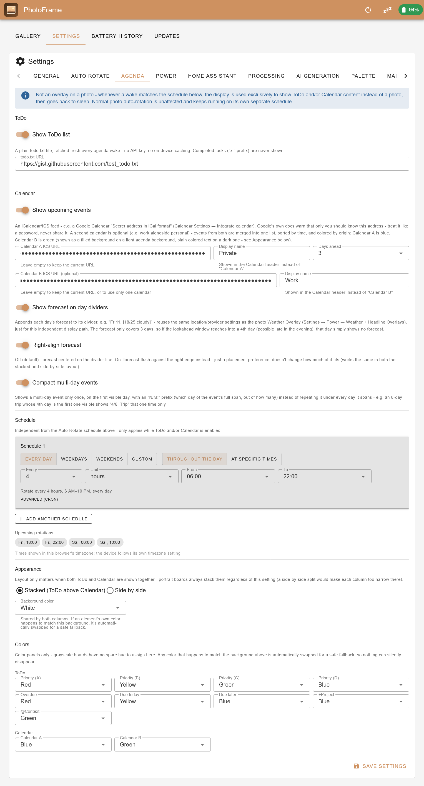

# ESP32 PhotoFrame - with optional native Telegram integration

A modern, feature-rich firmware for ESP32-based e-paper photo frames (currently supporting **Waveshare PhotoPainter**, **Seeed Studio XIAO EE02/EE03/EE04**, and **Seeed Studio reTerminal E1002/E1003/E1004**). This firmware replaces stock firmware with a powerful RESTful API, web interface, and **significantly better image quality**.

> **This is an independently maintained fork** of [aitjcize/esp32-photoframe](https://github.com/aitjcize/esp32-photoframe) (based on its `v2.18.0` release), maintained here as its own repository going forward rather than as a pull request back upstream. See [Changes from Upstream](#changes-from-upstream) below for the full list of what's different, and [Roadmap](#roadmap) for what's planned next. All companion-project links below (server, app, Home Assistant integration) point at the original upstream project's ecosystem, not this fork.


## Key Features

### Upstream & Fork

- 🎨 **Superior Image Quality**: Measured color palette with automatic calibration produces significantly better results than stock firmware
- 🔋 **Smart Power Management**: Deep sleep mode for weeks of battery life, or always-on for Home Assistant
- 📁 **Flexible Image Sources**: SD card rotation, URL-based fetching (weather, news, random images from image server)
- 🌐 **Modern Web Interface**: Drag-and-drop uploads, gallery view, real-time battery status
- 📱 **Mobile App**: [Companion app](https://github.com/aitjcize/esp32-photoframe-app) for WiFi provisioning, image processing, and AI generation
- 🖼️ **Image Server**: [Companion server](https://github.com/aitjcize/esp32-photoframe-server) with many photo sources — Google Photos, Immich, Synology Photos, Unsplash, Pexels, Telegram bot, URL proxy, and AI generation — plus date/time and weather overlays
- 🏠 **Home Assistant Ready**: [Companion integration](https://github.com/aitjcize/ha-esp32-photoframe) available
- 🔌 **RESTful API**: Full programmatic control ([API docs](docs/API.md))

### Fork only

- 🖼️ **Crop or Letterbox**: Choose whether mismatched-aspect-ratio images are cropped to fill the screen or shown in full with letterbox bars ([docs](docs/SCALE_MODE.md))
- 🙂 **Face-Aware Crop Metadata**: Optional offline face detection in `process-cli` recommends a crop that keeps faces fully visible instead of a plain center-crop, saved as a per-image JSON sidecar; the firmware can optionally pick between pre-rendered Cover/Fit variants per its own Scale Mode setting, avoiding on-device rendering entirely ([docs](docs/FACE_CROP.md))
- 🤖 **Telegram Bot**: Send photos straight to the frame via a Telegram bot, no extra server required, plus an extensive set of chat commands for remote control and status monitoring ([docs](docs/TELEGRAM.md))
- 🧩 **Orientation Pairing**: Two portrait photos are automatically combined side by side into one image instead of letterboxing either one — works for both Telegram receives and normal auto-rotation
- ☀️ **Weather + Headline Overlays**: Optional on-device weather line and news headlines drawn on the display, no companion server required ([docs](docs/OVERLAYS.md))
- 🪫 **Low-Battery Warnings**: On-display corner badge and a Telegram alert below a configurable threshold, plus a Battery History tab with a days-remaining-until-20% estimate
- ⚠️ **On-Display Error Banner**: Shows a short error message right on the frame after repeated WiFi/internet failures, not just in the logs
- 🔁 **No-Repeat Display History**: Random rotation remembers what's already been shown so every image appears once before any repeats
- 🗓️ **Agenda Mode**: ToDo (todo.txt format) and/or Calendar (up to two ICS/iCal URLs, merged) rendered full-screen — alone, or together stacked/side-by-side — on its own independent wake schedule that runs alongside normal photo rotation rather than replacing it; a matching wake just takes over the display for that one cycle, with color-coded priorities/tags/due dates, per-calendar-source colors, and a configurable background ([docs](docs/AGENDA_COLORS.html))

## Screenshots

<table>
<tr>
<td align="center"><b>Gallery & Albums</b></td>
<td align="center"><b>Battery History</b></td>
</tr>
<tr>
<td></td>
<td></td>
</tr>
</table>

**Weather, headline, and error overlays** are drawn directly on the device — no companion server needed:


**Agenda Mode** shows ToDo and/or Calendar content full-screen — alone, or together stacked/side-by-side — on its own independent wake schedule that runs alongside normal photo rotation rather than replacing it; a matching wake just takes over the display for that one cycle. Color-coded priorities/tags/due dates and per-calendar-source colors ([color scheme docs](docs/AGENDA_COLORS.html)):

<table>
<tr>
<td align="center"><b>Agenda → ToDo</b></td>
<td align="center"><b>Agenda → Calendar</b></td>
</tr>
<tr>
<td></td>
<td></td>
</tr>
</table>

<table>
<tr>
<td align="center"><b>Settings → Auto Rotate</b></td>
<td align="center"><b>Settings → Power</b></td>
<td align="center"><b>Settings → Agenda</b></td>
</tr>
<tr>
<td></td>
<td></td>
<td></td>
</tr>
</table>

## Ecosystem

This project has companion tools for different use cases:

| Project | Description |
|---------|-------------|
| [**ha-esp32-photoframe**](https://github.com/aitjcize/ha-esp32-photoframe) | Home Assistant integration for control, monitoring, and automation |
| [**esp32-photoframe-server**](https://github.com/aitjcize/esp32-photoframe-server) | Image server aggregating many photo sources — Gallery uploads, Google Photos, Immich, Synology Photos, Unsplash, Pexels, Telegram bot, URL proxy, and AI generation (OpenAI/Gemini) — with date/time & weather overlays and smart collage. Can be run as a Home Assistant add-on. |
| [**esp32-photoframe-app**](https://github.com/aitjcize/esp32-photoframe-app) | Mobile companion app for WiFi provisioning and device control. iOS: [App Store](https://apps.apple.com/tw/app/esp-frame/id6762510995?l=en-GB) (USD 2.99, to offset Apple's USD 99/yr developer fee). Android: [Google Play](https://play.google.com/store/apps/details?id=com.aitjcize.espframe) (free); join the [beta testers Google Group](https://groups.google.com/g/esp32-photoframe-app-testers) for early access to new features. |
| [**epaper-image-convert**](https://github.com/aitjcize/epaper-image-convert) | CLI tool & npm library for e-paper image conversion with advanced dithering |

## Third Party Integrations

| Project | Description |
|---------|-------------|
| [**puppet**](https://github.com/balloob/home-assistant-addons/tree/main/puppet) | HA Puppet add-on. Generate image URL from Puppet dashboard and use it as the Auto Rotate URL in PhotoFrame settings. |

## Image Quality Comparison

**🎨 [Try the Interactive Demo](https://aitjcize.github.io/esp32-photoframe/)** - Drag the slider to compare algorithms in real-time with your own images!

<table>
<tr>
<td align="center"><b>Original Image</b></td>
<td align="center"><b>Stock Algorithm<br/>(on computer)</b></td>
<td align="center"><b>Stock Algorithm<br/>(on device)</b></td>
<td align="center"><b>Our Algorithm<br/>(on device)</b></td>
</tr>
<tr>
<td><a href="https://github.com/aitjcize/esp32-photoframe/raw/refs/heads/main/.img/sample.jpg"></a></td>
<td><a href="https://github.com/aitjcize/esp32-photoframe/raw/refs/heads/main/.img/stock_algorithm_on_computer.bmp"></a></td>
<td><a href="https://github.com/aitjcize/esp32-photoframe/raw/refs/heads/main/.img/stock_algorithm.bmp"></a></td>
<td><a href="https://github.com/aitjcize/esp32-photoframe/raw/refs/heads/main/.img/our_algorithm.png"></a></td>
</tr>
<tr>
<td align="center">Source JPEG</td>
<td align="center">Theoretical palette<br/>(looks OK on screen)</td>
<td align="center">Theoretical palette<br/>(washed out on device)</td>
<td align="center">Measured palette<br/>(accurate colors)</td>
</tr>
</table>

**Why Our Algorithm is Better:**

- ✅ **Accurate Color Matching**: Uses actual measured e-paper colors
- ✅ **Automatic Calibration**: Built-in palette calibration tool adapts to your specific display
- ✅ **Better Dithering**: Floyd-Steinberg algorithm with measured palette produces more natural color transitions
- ✅ **No Over-Saturation**: Avoids the washed-out appearance of theoretical palette matching

The measured palette accounts for the fact that e-paper displays show darker, more muted colors than pure RGB values. By dithering with these actual colors, the firmware makes better decisions about which palette color to use for each pixel, resulting in images that look significantly better on the physical display. The automatic calibration feature allows you to measure and optimize the palette for your specific device.

📖 **[Read the technical deep-dive on measured color palettes →](docs/MEASURED_PALETTE.md)**

## Power Management

**Deep Sleep Enabled (Default)**:
- Battery life: months
- Wake via BOOT/KEY button or auto-rotate timer
- Web interface accessible only when awake
- Power: ~10μA in sleep

**Deep Sleep Disabled (Always-On)**:
- Best for Home Assistant integration
- Web interface always accessible
- Power: ~40-80mA with auto light sleep
- Battery life: days to weeks depending on usage

**Auto-Rotation**: SD card (default) or URL-based (fetch from web)

Configure via web interface **Settings** section.

### Real-World Battery Life

Upstream issue [#121](https://github.com/aitjcize/esp32-photoframe/issues/121) reports battery drain far short of "months" (10-15%/day) on several boards. This traced to two deep-sleep-wake crashes that only reproduce on battery power — a dynamic-frequency-scaling/WiFi-interrupt race, and a main-task stack overflow (see [Stability fixes](#changes-from-upstream) below), both confirmed via on-device coredump. A crash mid-sleep-entry forces a reboot instead of a real deep sleep, which is a plausible full explanation for the reported drain.

A ~9.9-day untethered soak test on a `waveshare_photopainter_73` running this fork's fixes measured **~1.17%/day** — roughly 10x better than the reported rate — with a Telegram bot, weather overlay, and WiFi power-save mode all active throughout:


So far, the fix is confirmed and shipped on `main` only for `waveshare_photopainter_73`, the one board available for direct testing here. `reterminal_e1002` shares the same SD-card/e-paper SPI-bus wiring implicated in part of the crash and is a strong candidate for the same fix; `xiao_ee02`/`xiao_ee04` would be by analogy only. Neither has shipped yet — tracked against issue #121, pending a build for owners of that hardware to confirm before merging.

## AI Image Generation 🤖

The web interface supports client-side AI image generation using OpenAI (GPT Image, DALL-E) or Google Gemini.

- **Generate on Demand**: Create custom artwork directly from the web interface using text prompts
- **Multiple Providers**: OpenAI and Google Gemini supported
- **Client-Side Processing**: AI generation runs in your browser, then uploads to the device

Configure your API keys in **Settings > AI Generation**.


## Supported Hardware

| Board | Display | Storage | Board Name |
|-------|---------|---------|------------|
| [Waveshare PhotoPainter](https://www.waveshare.com/wiki/ESP32-S3-PhotoPainter) | 7.3" **6-color** | SD card (SDIO) | `waveshare_photopainter_73` |
| [Seeed Studio XIAO EE02](https://www.seeedstudio.com/XIAO-ePaper-DIY-Kit-EE02-for-13-3-Spectratm-6-E-Ink.html) | 13.3" 6-color | Internal flash | `seeedstudio_xiao_ee02` |
| [Seeed Studio XIAO EE03](https://wiki.seeedstudio.com/getting_started_with_ee03/) | 10.3" 16-level grayscale | Internal flash | `seeedstudio_xiao_ee03` |
| [Seeed Studio XIAO EE04](https://www.seeedstudio.com/XIAO-ePaper-EE04-DIY-Bundle-Kit.html) | 7.3" 6-color | Internal flash | `seeedstudio_xiao_ee04` |
| [Seeed Studio reTerminal E1002](https://www.seeedstudio.com/reTerminal-E1002-p-6533.html) | 7.3" 6-color | SD card (SPI) + Internal flash | `seeedstudio_reterminal_e1002` |
| [Seeed Studio reTerminal E1003](https://www.seeedstudio.com/reTerminal-E1003-p-6731.html) | 10.3" 16-level grayscale | SD card (SPI) + Internal flash | `seeedstudio_reterminal_e1003` |
| [Seeed Studio reTerminal E1004](https://www.seeedstudio.com/reTerminal-E1004-p-6692.html) | 13.3" 6-color | SD card (SPI) + Internal flash | `seeedstudio_reterminal_e1004` |

The reTerminal E1002, E1003, and E1004 also include a SHT40 temperature/humidity sensor, PCF8563 RTC, and battery monitoring. The XIAO EE03 has a SHT40 sensor and battery monitoring as well (but no RTC).

### Button Functions

Buttons behave differently depending on whether the device is awake (web UI accessible) or in deep sleep.

**When in deep sleep:**

| Button | Waveshare PhotoPainter | XIAO EE02 / EE03 / EE04 | reTerminal E1002 | reTerminal E1003 | reTerminal E1004 |
|--------|----------------------|-------------------|------------------|------------------|------------------|
| **Wake** | BOOT button | Button 3 | Green button | Refresh button | Refresh button |
| **Rotate** | KEY button | Button 1 | Left button | Left button | Right button |
| **Clear** | N/A | Button 2 | Right button | Right button | Left button |

- **Wake**: Wakes the device and starts the web UI / HTTP server (stays awake)
- **Rotate**: Wakes the device, rotates to the next image, then goes back to sleep
- **Clear**: Wakes the device, clears the display to white, then goes back to sleep

**When awake:**

| Button | Function |
|--------|----------|
| **Rotate** | Rotates to the next image |
| **Clear** | Clears the display to white |

### 💾 Internal Flash Storage
Boards with larger flash chips (XIAO EE02/EE03/EE04, reTerminal E1002/E1004) use internal flash as persistent storage via LittleFS. On the reTerminal, the SD card takes priority when inserted; internal flash serves as a fallback. The Waveshare board does not have internal flash storage due to its 16MB flash being fully allocated to OTA partitions.

### Known Issues 🚧

- **PhotoPainter Restarts**: All existing Waveshare PhotoPainter boards on the market use the AXP2101 power management IC, which causes unexplained restarts when connected to both Type-C and a lithium battery simultaneously. **Workaround:** use either USB power only or battery only. Using both at the same time may cause frequent firmware restarts due to unstable power supply. Waveshare has confirmed this issue and future boards will ship with TG28 as a replacement, which will not have this problem. See [waveshareteam/ESP32-S3-PhotoPainter#5](https://github.com/waveshareteam/ESP32-S3-PhotoPainter/issues/5#issuecomment-3876269519) for details.
- **Seeed Studio Deep Sleep & USB Power**: The XIAO EE02, EE03, and EE04 can only detect USB connections from a **PC** (via USB-Serial-JTAG SOF packets); chargers and power banks will **not** keep them awake (these boards do not route USB VBUS to an ESP32 GPIO). The same applies to **reTerminal E1002 hardware revisions earlier than V1.2**, which use the non-I2C **ETA6003** charger. The reTerminal **E1002 V1.2+** (which switched to the **SY6974B** charger) **and the E1004** read the SY6974B's power-good status over I2C, so they detect *any* USB/charger/power-bank input and stay awake on external power automatically — no workaround needed. The Waveshare PhotoPainter likewise detects USB power via its AXP2101 PMIC. **Workaround (XIAO EE02/EE03/EE04, and E1002 boards older than V1.2):** if you want the device always accessible while powered by a charger or power bank, disable deep sleep in **Settings > General**.

## Installation

### Web Flasher (Easiest) ⚡

**[🌐 Flash from Browser](https://t3ste.github.io/Tlg-esp32-photoframe/#flash)** - Chrome/Edge/Opera required

### Manual Flash

Download from [Releases](https://github.com/t3ste/Tlg-esp32-photoframe/releases):

```bash
esptool.py --chip esp32s3 --port /dev/ttyUSB0 --baud 921600 write_flash 0x0 photoframe-firmware-<board>-merged.bin
```

**Device not detected?** Hold BOOT button + press PWR to enter download mode.

**Build from source:**

We provide a `build.py` helper script to simplify building for different boards.

```bash
# Build for Waveshare PhotoPainter (default)
./build.py --board waveshare_photopainter_73

# Build for Seeed Studio XIAO EE02
./build.py --board seeedstudio_xiao_ee02

# Build for Seeed Studio XIAO EE03 (10.3" 16-level grayscale e-paper)
./build.py --board seeedstudio_xiao_ee03

# Build for Seeed Studio XIAO EE04
./build.py --board seeedstudio_xiao_ee04

# Build for Seeed Studio reTerminal E1002
./build.py --board seeedstudio_reterminal_e1002

# Build for Seeed Studio reTerminal E1003 (10.3" 16-level grayscale e-paper)
./build.py --board seeedstudio_reterminal_e1003

# Build for Seeed Studio reTerminal E1004 (13.3" 6-color e-paper)
./build.py --board seeedstudio_reterminal_e1004

# Flash the firmware
idf.py -p /dev/ttyUSB0 flash monitor
```

For more details, see [DEV.md](docs/DEV.md)

### WiFi Provisioning

The device supports two methods for WiFi provisioning:

#### Option 1: SD Card Provisioning (boards with SD card only)

1. Create a file named `wifi.txt` on your SD card with:
   ```
   YourWiFiSSID
   YourWiFiPassword
   MyPhotoFrame
   ```
   - Line 1: WiFi SSID (network name)
   - Line 2: WiFi password
   - Line 3: Device name (optional, defaults to "PhotoFrame")
   - Use plain text, no quotes or extra formatting
   - The file can be placed at the root or in a `config/` folder

2. Insert SD card and power on the device
3. Device automatically reads credentials, saves to memory, and connects
4. The `wifi.txt` file is automatically deleted after reading (to prevent issues with invalid credentials)

**Note**: If credentials are invalid, the device will clear them and fall back to captive portal mode.

#### Option 2: Captive Portal

1. Device creates a unique AP on first boot (e.g. `PhotoFrame - A1B2C3`, where `A1B2C3` is derived from the device's MAC address)
2. Connect to the AP and open `http://192.168.4.1` (or use captive portal)
3. Enter WiFi credentials (2.4GHz only)
4. Device tests connection and saves if successful

#### Option 3: Companion App

1. Install the ESP Frame companion app:
   - **iOS**: [App Store](https://apps.apple.com/tw/app/esp-frame/id6762510995?l=en-GB)
   - **Android**: install from [Google Play](https://play.google.com/store/apps/details?id=com.aitjcize.espframe) (free); for early access to new features, join the [beta testers Google Group](https://groups.google.com/g/esp32-photoframe-app-testers)
2. Tap the "+" button on the home screen
3. The app scans for PhotoFrame setup hotspots, connects automatically, and guides you through WiFi configuration

**Re-provision:** Delete credentials with `idf.py erase-flash` or place new `wifi.txt` on SD card after clearing stored credentials

## Usage

**Web Interface:** `http://photoframe.local` or device IP address
- Gallery view with drag-and-drop uploads
- Settings, battery status, display control

**API:** Full documentation in [API.md](docs/API.md)

## Troubleshooting

- **WiFi issues**: Ensure 2.4GHz network, check serial monitor for IP
- **SD card not detected**: Format as FAT32, try different card
- **Upload fails**: Check file is valid JPEG, monitor serial output
- **Device not detected for flash**: Hold BOOT + press PWR for download mode

## Offline Image Processing

Node.js CLI tool for batch processing and image serving:

### Batch Processing
```bash
cd process-cli && npm install
# Process to disk
node cli.js input.jpg --device-parameters -o /path/to/sdcard/images/

# Or upload directly to device
node cli.js ~/Photos/Albums --upload --device-parameters --host photoframe.local
```

### Image Server Mode
Serve pre-processed images directly to your ESP32 over HTTP:

```bash
node cli.js --serve ~/Photos --serve-port 9000 --device-parameters --host photoframe.local
```

The ESP32 can fetch images from your computer instead of storing them on SD card. Supports EPDGZ, BMP, PNG, and JPG formats with automatic thumbnail generation.

See [process-cli/README.md](process-cli/README.md) for details.

**Building your own image server?** The firmware's URL rotation fetch protocol — request method, custom `X-*` headers, `Authorization` / custom-header handling, and the `ETag` / `304 Not Modified` caching flow — is documented in [docs/API.md → URL Rotation Fetch](docs/API.md#url-rotation-fetch).

## Changes from Upstream

This fork is ahead of [aitjcize/esp32-photoframe](https://github.com/aitjcize/esp32-photoframe)'s `main` by 80+ commits. Everything documented in [docs/DIFF.md](docs/DIFF.md) is new in this fork, not present upstream.

## Roadmap

Planned for upcoming work on this fork:

- ~~Update config backup/restore to cover the new settings and parameters added so far~~ — done, config export/import now also covers per-album enable/disable state
- ~~Publish GitHub Releases for this fork (currently only buildable from source)~~ — done, own CI/release pipeline with per-board flashable binaries
- ~~Adapt the OTA update mechanism, which still points at the upstream project's release feed~~ — done, OTA now points at this fork's own repo and correctly handles GitHub's chunked API responses
- ~~Display delta updates instead of a full refresh~~ — investigated, not possible on the required `waveshare_photopainter_73` board (or any other color board this project targets): 6-color e-paper panels have no partial-refresh mode at the protocol or physical level. See [docs/OVERLAYS.md → Why there's no partial-refresh ("delta update") mode](docs/OVERLAYS.md#why-theres-no-partial-refresh-delta-update-mode) for the full explanation, including why the grayscale boards' IT8951 controller (which does support it) isn't pursued as a partial fix either.
- Performance/resource-usage optimization — album scanning/management via lightweight index files (txt/JSON) instead of repeated directory walks, and a configurable wake-cycle time budget (e.g. "spend at most 20 seconds on network activity, then go back to sleep"), including capping how much of a wake cycle a burst of new Telegram messages can consume
- Document the recommended course of action when a device's orientation is changed between landscape and portrait after the fact, since `process-cli`'s rendered Cover/Fit variants and face-crop metadata are generated for one specific target orientation and don't automatically adapt to a later change
- Agenda mode: multi-line ToDo/Calendar entries with word-wrap and a leading bullet character, as a selectable display option (currently every row is truncated to one physical line)
- Agenda mode: incremental/streaming ICS parsing, so the Calendar column's response-size cap doesn't need to keep being raised as a linked calendar's exported file grows over time (currently a flat 2MB buffer)
- ~~Agenda mode only fired from the deep-sleep timer-wake path, silently never running with Deep Sleep disabled (e.g. Home Assistant / always-on use)~~ — done, the always-on `rotation_timer_task()` (`power_manager.c`) now runs Agenda on its own independent schedule too, under the same "USB-powered or deep sleep disabled" condition photo rotation already uses there, with the same "Agenda wins on an exact-same-tick collision, rotation just continues on its own next slot" rule as the deep-sleep path
- Surface the next scheduled Agenda wake in the Web UI status area, mirroring the existing (also still-planned) "next rotation" display - the backend function (`agenda_manager_seconds_until_next_wake()`) already exists but isn't exposed via the API yet
- Agenda mode: optional `agenda_todo_show_done` toggle to also show completed ToDo items (currently always excluded) - scoped during the original design but never implemented
- Factory reset erases the Agenda ETag cache validators from NVS but leaves the small `.agenda_*_cache.*` files behind on the SD card/internal flash - harmless (a few KB to low MB), but not cleaned up
- ~~Investigate the ESP-IDF NVS partition possibly running out of free pages under heavy cumulative write load, which would explain unexplained WiFi-reprovisioning-after-reflash incidents without a flash tool ever having touched the NVS region directly~~ — investigated with live evidence (`nvs_get_stats()`, added specifically to check this) and ruled out for the incidents that prompted it: NVS had 465/756 entries free at the time. The real cause was found instead in the always-on cold-boot path (`main.c`): a single failed WiFi connection attempt at boot immediately erased the saved SSID/password, regardless of whether the failure was a confirmed bad password or just a transient hiccup (router mid-reboot, brief congestion) - now retries up to 3 times unless the AP's disconnect reason explicitly indicates rejected credentials (failed 4-way handshake/MIC failure/auth-fail), in which case it still stops after one attempt as before. The `nvs_get_stats()` diagnostic logging itself was kept regardless, as permanent low-cost health telemetry
- ~~A device that fell back to WiFi captive-portal mode was observed needing a second, separate reprovisioning shortly after the first succeeded~~ — very likely the same cold-boot credential-clearing bug fixed above (a transient failure during that session's testing hitting the same code path), though that specific historical occurrence itself was never directly re-diagnosed

## License

This project is based on the ESP32-S3-PhotoPainter sample code. Please refer to the original project for licensing information.

## Credits

- Upstream project: [aitjcize/esp32-photoframe](https://github.com/aitjcize/esp32-photoframe)
- Original PhotoPainter sample: Waveshare ESP32-S3-PhotoPainter
- E-paper drivers: Waveshare
- ESP-IDF: Espressif Systems
