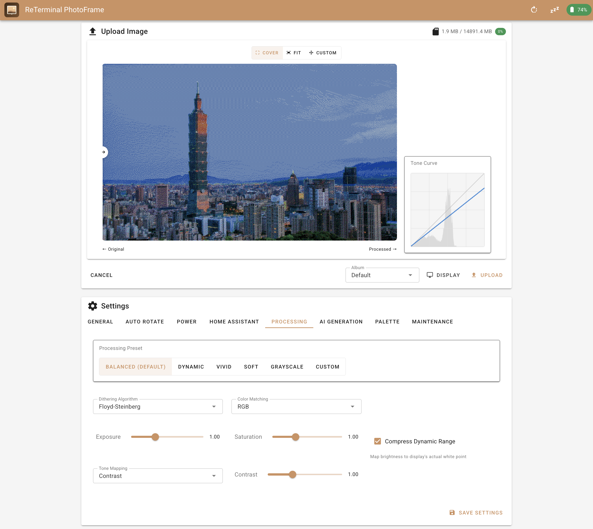
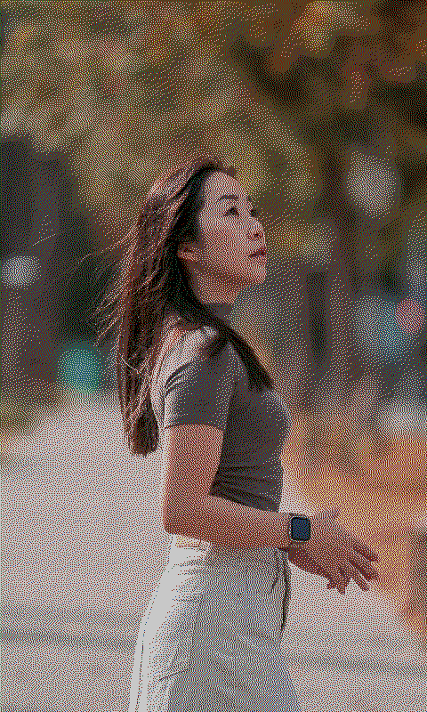

# ESP32 PhotoFrame

A modern, feature-rich firmware for ESP32-based e-paper photo frames (currently supporting **Waveshare PhotoPainter**, **Seeed Studio XIAO EE02/EE03/EE04**, and **Seeed Studio reTerminal E1002/E1003/E1004**). This firmware replaces stock firmware with a powerful RESTful API, web interface, and **significantly better image quality**.

> **This is an independently maintained fork** of [aitjcize/esp32-photoframe](https://github.com/aitjcize/esp32-photoframe) (based on its `v2.18.0` release), maintained here as its own repository going forward rather than as a pull request back upstream. See [Changes from Upstream](#changes-from-upstream) below for the full list of what's different, and [Roadmap](#roadmap) for what's planned next. All companion-project links below (server, app, Home Assistant integration) point at the original upstream project's ecosystem, not this fork.



## Key Features

- 🎨 **Superior Image Quality**: Measured color palette with automatic calibration produces significantly better results than stock firmware
- 🖼️ **Crop or Letterbox**: Choose whether mismatched-aspect-ratio images are cropped to fill the screen or shown in full with letterbox bars ([docs](docs/SCALE_MODE.md))
- 🙂 **Face-Aware Crop Metadata**: Optional offline face detection in `process-cli` recommends a crop that keeps faces fully visible instead of a plain center-crop, saved as a per-image JSON sidecar; the firmware can optionally pick between pre-rendered Cover/Fit variants per its own Scale Mode setting, avoiding on-device rendering entirely ([docs](docs/FACE_CROP.md))
- 🔋 **Smart Power Management**: Deep sleep mode for weeks of battery life, or always-on for Home Assistant
- 📁 **Flexible Image Sources**: SD card rotation, URL-based fetching (weather, news, random images from image server)
- 🤖 **Telegram Bot**: Send photos straight to the frame via a Telegram bot, no extra server required ([docs](docs/TELEGRAM.md))
- ☀️ **Weather + Headline Overlays**: Optional on-device weather line and news headlines drawn on the display, no companion server required ([docs](docs/OVERLAYS.md))
- 🌐 **Modern Web Interface**: Drag-and-drop uploads, gallery view, real-time battery status
- 📱 **Mobile App**: [Companion app](https://github.com/aitjcize/esp32-photoframe-app) for WiFi provisioning, image processing, and AI generation
- 🖼️ **Image Server**: [Companion server](https://github.com/aitjcize/esp32-photoframe-server) with many photo sources — Google Photos, Immich, Synology Photos, Unsplash, Pexels, Telegram bot, URL proxy, and AI generation — plus date/time and weather overlays
- 🏠 **Home Assistant Ready**: [Companion integration](https://github.com/aitjcize/ha-esp32-photoframe) available
- 🔌 **RESTful API**: Full programmatic control ([API docs](docs/API.md))

## Changes from Upstream

This fork is ahead of [aitjcize/esp32-photoframe](https://github.com/aitjcize/esp32-photoframe)'s `main` by 40+ commits. Everything below is new in this fork, not present upstream:

**Telegram Bot integration** ([docs](docs/TELEGRAM.md)):
- feat: native Telegram Bot rotation mode — send photos straight to the frame, alongside (not replacing) SD-card/URL rotation, with progressive-JPEG fallback through Telegram's alternate photo resolutions
- feat: Telegram image caption drawn as a text overlay on the photo
- feat: extensive Telegram command set for remote control/configuration (`/status`, `/clear`, `/restart`, `/pairing`, `/rotate_cron`, `/deep_sleep`, `/auto_rotate`, `/wake_notify`, `/error_overlay`, `/wifi_perf`, `/help`, `/list_albums`, `/active_albums`, `/enable_album`, `/clear_history`, `/rotation_notify`, `/rotation_pairing`, `/keep_originals`, `/exif_date`), plus an emergency `/telegram_reset` that clears the queue and sleeps immediately, bypassing normal processing
- feat: `/start` treated as an alias for `/help` (Telegram clients send it automatically on first open)
- feat: orientation pairing — combine two complementary portrait/landscape photos into one composed image instead of letterboxing either one (Telegram-only at first, later extended to normal auto-rotation too)
- feat: album fallback rotation for Telegram mode — falls back to normal rotation instead of leaving the previous image up indefinitely when a poll doesn't yield a new image, with an optional Telegram notification (photo re-upload) so the chat still reflects what's on the frame; itself toggleable, so the frame can instead be pinned to show only actual Telegram photos and never change on a wake with nothing new — with a second, related toggle deciding separately whether a Telegram connection failure (vs. a poll that simply found nothing new) still counts as an exception that falls back
- feat: Telegram "keep originals" toggle — archives each received photo's raw bytes (always the largest available size) to `Telegram/Originals`
- feat: streaming JPEG decoder for large Telegram document uploads that don't fit in one contiguous PSRAM buffer
- feat: experimental EXIF capture-date fallback caption when a received photo has no caption of its own
- feat: low-battery Telegram warning (below 20%, debounced per discharge cycle)
- feat: reports the actually-used weather source in `/status` (the configured provider and the one that last actually succeeded can differ)
- feat: opt-in duplicate detection via Telegram's own content-based `file_unique_id` — a re-sent/forwarded photo or file is skipped before downloading anything, no local hashing needed
- feat: EPDGZ output for composed orientation pairs, following the same on-device image format setting used for a single photo
- fix: Telegram thumbnail generation could silently overwrite/corrupt the just-downloaded original photo before it was ever converted or archived
- fix: don't reject large Telegram JPEGs before download now that the streaming decoder can actually handle them
- fix: a document upload's "saved" confirmation tried to echo back its thumbnail file as a photo, which Telegram categorically rejects — falls back to a text-only confirmation now

**Face-Aware Crop** ([docs](docs/FACE_CROP.md)):
- feat: offline face detection in `process-cli` (BlazeFace, fully offline-capable) recommends a crop that keeps faces fully visible, saved as a versioned `<name>.facecrop.json` sidecar (39 unit tests, pure-logic coverage)
- feat: `--crop-output cropped|uncropped|both` — render the face-aware Cover crop, the uncropped Fit letterbox, or both side by side, so an album can be pre-rendered for either firmware Scale Mode setting without re-processing
- feat: `--crop-preview` — writes the full, unmodified source image with detected face boxes (blue) and the recommended crop rectangle (red) overlaid, for sanity-checking face detection/the crop heuristic before a real batch render
- fix: switched process-cli's canvas library from `canvas` to `@napi-rs/canvas` (severe Windows-only native memory leak that crashed large `--detect-faces --crop-output both` batches), which surfaced a latent Canvas-vs-ImageData detection bug in the shared rendering pipeline — both fixed
- feat: firmware-side, opt-in on-demand Cover/Fit rendering — the device recognizes pre-rendered `<name>.cover.<ext>` / `<name>.fit.<ext>` variants and picks whichever matches its own Scale Mode setting, falling back to a one-time on-device render (cached afterwards) only for a genuinely still-undecoded source, verified by content, not filename
- feat: Web UI "Organize Crop Folders" maintenance action, and Cover/Fit variant pairs are deduplicated to one entry in the gallery listing and rotation loops

**Image formats & processing**:
- feat: new on-device EPDGZ encoder — Telegram-ingested photos can now be converted straight to EPDGZ (palette-indexed, gzip-compressed) instead of always PNG, matching what Web UI uploads already produced client-side; configurable per ingestion path (Telegram: device-side setting; Web UI: browser-side setting), with automatic fallback to PNG if EPDGZ can't get the memory it needs
- feat: streaming JPEG decode fallback (`tjpgd`'s low-level API driven directly) for oversized documents that don't fit the all-in-one-buffer decode path

**Weather & headline overlays** ([docs](docs/OVERLAYS.md)):
- feat: native 3-day forecast weather overlay + RSS/Atom news headline overlay drawn on the display — no companion server or API keys needed
- feat: selectable weather data source (Open-Meteo, wttr.in, or yr.no/MET Norway)
- feat: overlay colors (black bar/white text, or inverted) and English/German condition wording, shared with Telegram caption styling
- feat: opt-in overlay support for already-rendered EPDGZ Storage/Auto-Rotate album images (previously PNG-only) — decodes, draws, and re-encodes the one file being shown, off by default since it's an extra step per display
- fix: the Web UI's "Display Image" gallery action never applied weather/headline overlays at all (any format, any settings) — it bypassed overlay compositing entirely, unlike the Auto-Rotate loops

**Web UI**:
- feat: display history with a reset button (Settings → Auto Rotate) — random rotation cycles through every image once before repeating, persisted across reboots
- feat: toggleable thumbnail loading in the gallery (was unconditionally slowing down the HTTP server)
- feat: battery history tab (hand-rolled SVG chart) with an estimated days-remaining-until-20% figure, plus a reset button
- feat: real top-level tabs (Gallery / Settings / Battery History / Updates) instead of one long stacked page
- feat: on-display error banner, testable on demand via a Web UI button
- feat: WiFi TX-power cap for Waveshare PhotoPainter battery-brownout mitigation, now user-toggleable (default on)

**Stability fixes**:
- fix: resolve battery-wake stability issues on Waveshare PhotoPainter — a dynamic-frequency-scaling/WiFi-interrupt race and a main-task stack overflow, both confirmed via on-device coredump
- fix: WiFi TX-power cap was gated on USB being disconnected, backwards from the actual Waveshare PMIC brownout condition (USB **and** battery connected together) — now gated on battery presence instead
- fix: several task stack-overflow crashes in the Telegram/rotation pipeline (button task, deep-sleep wake, HTTP `/api/rotate`), each confirmed via live coredump and moved off the shared main-task stack where possible
- fix: `album_manager_delete_album()` failed to delete an album containing a subdirectory
- fix: `build.py` couldn't find `idf.py` on a standard Windows ESP-IDF PowerShell install

## Ecosystem

This project has companion tools for different use cases:

| Project | Description |
|---------|-------------|
| [**ha-esp32-photoframe**](https://github.com/aitjcize/ha-esp32-photoframe) | Home Assistant integration for control, monitoring, and automation |
| [**esp32-photoframe-server**](https://github.com/aitjcize/esp32-photoframe-server) | Image server aggregating many photo sources — Gallery uploads, Google Photos, Immich, Synology Photos, Unsplash, Pexels, Telegram bot, URL proxy, and AI generation (OpenAI/Gemini) — with date/time & weather overlays and smart collage. Can be run as a Home Assistant add-on. |
| [**esp32-photoframe-app**](https://github.com/aitjcize/esp32-photoframe-app) | Mobile companion app for WiFi provisioning and device control. iOS: [App Store](https://apps.apple.com/tw/app/esp-frame/id6762510995?l=en-GB) (USD 2.99, to offset Apple's USD 99/yr developer fee). Android: [Google Play](https://play.google.com/store/apps/details?id=com.aitjcize.espframe) (free); join the [beta testers Google Group](https://groups.google.com/g/esp32-photoframe-app-testers) for early access to new features. |
| [**epaper-image-convert**](https://github.com/aitjcize/epaper-image-convert) | CLI tool & npm library for e-paper image conversion with advanced dithering |

## Third Party Integrations

| Project | Description |
|---------|-------------|
| [**puppet**](https://github.com/balloob/home-assistant-addons/tree/main/puppet) | HA Puppet add-on. Generate image URL from Puppet dashboard and use it as the Auto Rotate URL in PhotoFrame settings. |

## Image Quality Comparison

**🎨 [Try the Interactive Demo](https://aitjcize.github.io/esp32-photoframe/)** - Drag the slider to compare algorithms in real-time with your own images!

<table>
<tr>
<td align="center"><b>Original Image</b></td>
<td align="center"><b>Stock Algorithm<br/>(on computer)</b></td>
<td align="center"><b>Stock Algorithm<br/>(on device)</b></td>
<td align="center"><b>Our Algorithm<br/>(on device)</b></td>
</tr>
<tr>
<td><a href="https://github.com/aitjcize/esp32-photoframe/raw/refs/heads/main/.img/sample.jpg"></a></td>
<td><a href="https://github.com/aitjcize/esp32-photoframe/raw/refs/heads/main/.img/stock_algorithm_on_computer.bmp"></a></td>
<td><a href="https://github.com/aitjcize/esp32-photoframe/raw/refs/heads/main/.img/stock_algorithm.bmp"></a></td>
<td><a href="https://github.com/aitjcize/esp32-photoframe/raw/refs/heads/main/.img/our_algorithm.png"></a></td>
</tr>
<tr>
<td align="center">Source JPEG</td>
<td align="center">Theoretical palette<br/>(looks OK on screen)</td>
<td align="center">Theoretical palette<br/>(washed out on device)</td>
<td align="center">Measured palette<br/>(accurate colors)</td>
</tr>
</table>

**Why Our Algorithm is Better:**

- ✅ **Accurate Color Matching**: Uses actual measured e-paper colors
- ✅ **Automatic Calibration**: Built-in palette calibration tool adapts to your specific display
- ✅ **Better Dithering**: Floyd-Steinberg algorithm with measured palette produces more natural color transitions
- ✅ **No Over-Saturation**: Avoids the washed-out appearance of theoretical palette matching

The measured palette accounts for the fact that e-paper displays show darker, more muted colors than pure RGB values. By dithering with these actual colors, the firmware makes better decisions about which palette color to use for each pixel, resulting in images that look significantly better on the physical display. The automatic calibration feature allows you to measure and optimize the palette for your specific device.

📖 **[Read the technical deep-dive on measured color palettes →](docs/MEASURED_PALETTE.md)**

## Power Management

**Deep Sleep Enabled (Default)**:
- Battery life: months
- Wake via BOOT/KEY button or auto-rotate timer
- Web interface accessible only when awake
- Power: ~10μA in sleep

**Deep Sleep Disabled (Always-On)**:
- Best for Home Assistant integration
- Web interface always accessible
- Power: ~40-80mA with auto light sleep
- Battery life: days to weeks depending on usage

**Auto-Rotation**: SD card (default) or URL-based (fetch from web)

Configure via web interface **Settings** section.

## AI Image Generation 🤖

The web interface supports client-side AI image generation using OpenAI (GPT Image, DALL-E) or Google Gemini.

- **Generate on Demand**: Create custom artwork directly from the web interface using text prompts
- **Multiple Providers**: OpenAI and Google Gemini supported
- **Client-Side Processing**: AI generation runs in your browser, then uploads to the device

Configure your API keys in **Settings > AI Generation**.


## Supported Hardware

| Board | Display | Storage | Board Name |
|-------|---------|---------|------------|
| [Waveshare PhotoPainter](https://www.waveshare.com/wiki/ESP32-S3-PhotoPainter) | 7.3" 7-color | SD card (SDIO) | `waveshare_photopainter_73` |
| [Seeed Studio XIAO EE02](https://www.seeedstudio.com/XIAO-ePaper-DIY-Kit-EE02-for-13-3-Spectratm-6-E-Ink.html) | 13.3" 6-color | Internal flash | `seeedstudio_xiao_ee02` |
| [Seeed Studio XIAO EE03](https://wiki.seeedstudio.com/getting_started_with_ee03/) | 10.3" 16-level grayscale | Internal flash | `seeedstudio_xiao_ee03` |
| [Seeed Studio XIAO EE04](https://www.seeedstudio.com/XIAO-ePaper-EE04-DIY-Bundle-Kit.html) | 7.3" 6-color | Internal flash | `seeedstudio_xiao_ee04` |
| [Seeed Studio reTerminal E1002](https://www.seeedstudio.com/reTerminal-E1002-p-6533.html) | 7.3" 6-color | SD card (SPI) + Internal flash | `seeedstudio_reterminal_e1002` |
| [Seeed Studio reTerminal E1003](https://www.seeedstudio.com/reTerminal-E1003-p-6731.html) | 10.3" 16-level grayscale | SD card (SPI) + Internal flash | `seeedstudio_reterminal_e1003` |
| [Seeed Studio reTerminal E1004](https://www.seeedstudio.com/reTerminal-E1004-p-6692.html) | 13.3" 6-color | SD card (SPI) + Internal flash | `seeedstudio_reterminal_e1004` |

The reTerminal E1002, E1003, and E1004 also include a SHT40 temperature/humidity sensor, PCF8563 RTC, and battery monitoring. The XIAO EE03 has a SHT40 sensor and battery monitoring as well (but no RTC).

### Button Functions

Buttons behave differently depending on whether the device is awake (web UI accessible) or in deep sleep.

**When in deep sleep:**

| Button | Waveshare PhotoPainter | XIAO EE02 / EE03 / EE04 | reTerminal E1002 | reTerminal E1003 | reTerminal E1004 |
|--------|----------------------|-------------------|------------------|------------------|------------------|
| **Wake** | BOOT button | Button 3 | Green button | Refresh button | Refresh button |
| **Rotate** | KEY button | Button 1 | Left button | Left button | Right button |
| **Clear** | N/A | Button 2 | Right button | Right button | Left button |

- **Wake**: Wakes the device and starts the web UI / HTTP server (stays awake)
- **Rotate**: Wakes the device, rotates to the next image, then goes back to sleep
- **Clear**: Wakes the device, clears the display to white, then goes back to sleep

**When awake:**

| Button | Function |
|--------|----------|
| **Rotate** | Rotates to the next image |
| **Clear** | Clears the display to white |

### 💾 Internal Flash Storage
Boards with larger flash chips (XIAO EE02/EE03/EE04, reTerminal E1002/E1004) use internal flash as persistent storage via LittleFS. On the reTerminal, the SD card takes priority when inserted; internal flash serves as a fallback. The Waveshare board does not have internal flash storage due to its 16MB flash being fully allocated to OTA partitions.

### Known Issues 🚧

- **PhotoPainter Restarts**: All existing Waveshare PhotoPainter boards on the market use the AXP2101 power management IC, which causes unexplained restarts when connected to both Type-C and a lithium battery simultaneously. **Workaround:** use either USB power only or battery only. Using both at the same time may cause frequent firmware restarts due to unstable power supply. Waveshare has confirmed this issue and future boards will ship with TG28 as a replacement, which will not have this problem. See [waveshareteam/ESP32-S3-PhotoPainter#5](https://github.com/waveshareteam/ESP32-S3-PhotoPainter/issues/5#issuecomment-3876269519) for details.
- **Seeed Studio Deep Sleep & USB Power**: The XIAO EE02, EE03, and EE04 can only detect USB connections from a **PC** (via USB-Serial-JTAG SOF packets); chargers and power banks will **not** keep them awake (these boards do not route USB VBUS to an ESP32 GPIO). The same applies to **reTerminal E1002 hardware revisions earlier than V1.2**, which use the non-I2C **ETA6003** charger. The reTerminal **E1002 V1.2+** (which switched to the **SY6974B** charger) **and the E1004** read the SY6974B's power-good status over I2C, so they detect *any* USB/charger/power-bank input and stay awake on external power automatically — no workaround needed. The Waveshare PhotoPainter likewise detects USB power via its AXP2101 PMIC. **Workaround (XIAO EE02/EE03/EE04, and E1002 boards older than V1.2):** if you want the device always accessible while powered by a charger or power bank, disable deep sleep in **Settings > General**.

## Installation

### Web Flasher (Easiest) ⚡

**[🌐 Flash from Browser](https://aitjcize.github.io/esp32-photoframe/#flash)** - Chrome/Edge/Opera required

### Manual Flash

Download from [Releases](https://github.com/aitjcize/esp32-photoframe/releases):

```bash
esptool.py --chip esp32s3 --port /dev/ttyUSB0 --baud 921600 write_flash 0x0 photoframe-firmware-<board>-merged.bin
```

**Device not detected?** Hold BOOT button + press PWR to enter download mode.

**Build from source:**

We provide a `build.py` helper script to simplify building for different boards.

```bash
# Build for Waveshare PhotoPainter (default)
./build.py --board waveshare_photopainter_73

# Build for Seeed Studio XIAO EE02
./build.py --board seeedstudio_xiao_ee02

# Build for Seeed Studio XIAO EE03 (10.3" 16-level grayscale e-paper)
./build.py --board seeedstudio_xiao_ee03

# Build for Seeed Studio XIAO EE04
./build.py --board seeedstudio_xiao_ee04

# Build for Seeed Studio reTerminal E1002
./build.py --board seeedstudio_reterminal_e1002

# Build for Seeed Studio reTerminal E1003 (10.3" 16-level grayscale e-paper)
./build.py --board seeedstudio_reterminal_e1003

# Build for Seeed Studio reTerminal E1004 (13.3" 6-color e-paper)
./build.py --board seeedstudio_reterminal_e1004

# Flash the firmware
idf.py -p /dev/ttyUSB0 flash monitor
```

For more details, see [DEV.md](docs/DEV.md)

### WiFi Provisioning

The device supports two methods for WiFi provisioning:

#### Option 1: SD Card Provisioning (boards with SD card only)

1. Create a file named `wifi.txt` on your SD card with:
   ```
   YourWiFiSSID
   YourWiFiPassword
   MyPhotoFrame
   ```
   - Line 1: WiFi SSID (network name)
   - Line 2: WiFi password
   - Line 3: Device name (optional, defaults to "PhotoFrame")
   - Use plain text, no quotes or extra formatting
   - The file can be placed at the root or in a `config/` folder

2. Insert SD card and power on the device
3. Device automatically reads credentials, saves to memory, and connects
4. The `wifi.txt` file is automatically deleted after reading (to prevent issues with invalid credentials)

**Note**: If credentials are invalid, the device will clear them and fall back to captive portal mode.

#### Option 2: Captive Portal

1. Device creates a unique AP on first boot (e.g. `PhotoFrame - A1B2C3`, where `A1B2C3` is derived from the device's MAC address)
2. Connect to the AP and open `http://192.168.4.1` (or use captive portal)
3. Enter WiFi credentials (2.4GHz only)
4. Device tests connection and saves if successful

#### Option 3: Companion App

1. Install the ESP Frame companion app:
   - **iOS**: [App Store](https://apps.apple.com/tw/app/esp-frame/id6762510995?l=en-GB)
   - **Android**: install from [Google Play](https://play.google.com/store/apps/details?id=com.aitjcize.espframe) (free); for early access to new features, join the [beta testers Google Group](https://groups.google.com/g/esp32-photoframe-app-testers)
2. Tap the "+" button on the home screen
3. The app scans for PhotoFrame setup hotspots, connects automatically, and guides you through WiFi configuration

**Re-provision:** Delete credentials with `idf.py erase-flash` or place new `wifi.txt` on SD card after clearing stored credentials

## Usage

**Web Interface:** `http://photoframe.local` or device IP address
- Gallery view with drag-and-drop uploads
- Settings, battery status, display control

**API:** Full documentation in [API.md](docs/API.md)

## Troubleshooting

- **WiFi issues**: Ensure 2.4GHz network, check serial monitor for IP
- **SD card not detected**: Format as FAT32, try different card
- **Upload fails**: Check file is valid JPEG, monitor serial output
- **Device not detected for flash**: Hold BOOT + press PWR for download mode

## Offline Image Processing

Node.js CLI tool for batch processing and image serving:

### Batch Processing
```bash
cd process-cli && npm install
# Process to disk
node cli.js input.jpg --device-parameters -o /path/to/sdcard/images/

# Or upload directly to device
node cli.js ~/Photos/Albums --upload --device-parameters --host photoframe.local
```

### Image Server Mode
Serve pre-processed images directly to your ESP32 over HTTP:

```bash
node cli.js --serve ~/Photos --serve-port 9000 --device-parameters --host photoframe.local
```

The ESP32 can fetch images from your computer instead of storing them on SD card. Supports EPDGZ, BMP, PNG, and JPG formats with automatic thumbnail generation.

See [process-cli/README.md](process-cli/README.md) for details.

**Building your own image server?** The firmware's URL rotation fetch protocol — request method, custom `X-*` headers, `Authorization` / custom-header handling, and the `ETag` / `304 Not Modified` caching flow — is documented in [docs/API.md → URL Rotation Fetch](docs/API.md#url-rotation-fetch).

## Roadmap

Planned for upcoming work on this fork:

- Update config backup/restore to cover the new settings and parameters added so far
- Publish GitHub Releases for this fork (currently only buildable from source)
- Adapt the OTA update mechanism, which still points at the upstream project's release feed
- ~~Display delta updates instead of a full refresh~~ — investigated, not possible on the required `waveshare_photopainter_73` board (or any other color board this project targets): 6-color e-paper panels have no partial-refresh mode at the protocol or physical level. See [docs/OVERLAYS.md → Why there's no partial-refresh ("delta update") mode](docs/OVERLAYS.md#why-theres-no-partial-refresh-delta-update-mode) for the full explanation, including why the grayscale boards' IT8951 controller (which does support it) isn't pursued as a partial fix either.
- Performance/resource-usage optimization — album scanning/management via lightweight index files (txt/JSON) instead of repeated directory walks, and a configurable wake-cycle time budget (e.g. "spend at most 20 seconds on network activity, then go back to sleep"), including capping how much of a wake cycle a burst of new Telegram messages can consume
- Document the recommended course of action when a device's orientation is changed between landscape and portrait after the fact, since `process-cli`'s rendered Cover/Fit variants and face-crop metadata are generated for one specific target orientation and don't automatically adapt to a later change

## Support

If you find this project useful, consider buying me a coffee! ☕

[](https://buymeacoffee.com/aitjcize)

## License

This project is based on the ESP32-S3-PhotoPainter sample code. Please refer to the original project for licensing information.

## Credits

- Original PhotoPainter sample: Waveshare ESP32-S3-PhotoPainter
- E-paper drivers: Waveshare
- ESP-IDF: Espressif Systems
